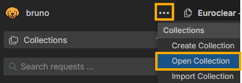
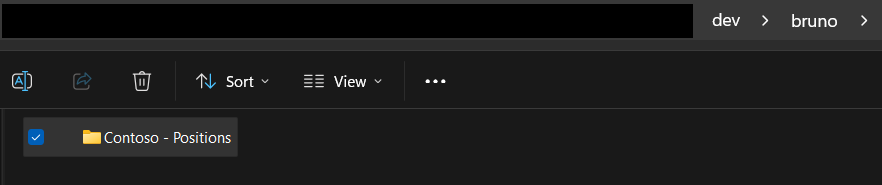

# Bruno Collection Process

## Overview

Every API project with callable APIs includes a `bruno/` folder in that API project's directory. The `bruno/` folder is intended to hold the Bruno collection for that API project.

In the standard workflow, one API project maps to one Bruno collection. The collection folder name helps identify the collection in Bruno and on disk, but the `bruno/` folder is not intended to accumulate multiple sibling collections for the same API project.

## Collection Structure

The Bruno collection follows a standardized folder structure:

```text
bruno/
└───Contoso - <API NAME>/
  ├───environments/
  │   ├───LOCAL.bru
  │   ├───DEV.bru
  │   └───TST.bru
  ├───<Controller name 1>/
  │   └───<api-name-1>.bru
  └───<Controller name 2>/
    └───<api-name-2>.bru
```

### Example Structure

```text
bruno/
└───Contoso - Experience/
  ├───environments/
  │   ├───LOCAL.bru
  │   ├───MS DEV.bru
  │   └───MS TST.bru
  ├───Events/
  │   └───get-event-detail.bru
  └───Shareholders/
    └───get-shareholders-lite.bru
```

## Getting Started

### Opening a Collection

1. In Bruno, click on the `···` button and select `Open Collection` from dropdown.
   
1. Navigate to and select the collection folder inside the API project's `bruno/` directory.
   

## Development Guidelines

### Pull Request Requirements

1. **Include Bruno files**: Add corresponding `.bru` files for any new APIs in your pull request
2. **Follow naming conventions**: Use descriptive names that match your API endpoints
3. **Organize by controller**: Place API files in folders named after their respective controllers
4. **Update environments**: Ensure all environments (LOCAL, DEV, TST) are properly configured

⚠️ **Security Warning**: _Never commit actual secrets, API keys, passwords, or sensitive data to the repository. Ensure all sensitive data is properly marked as secret in Bruno environment files._


### File Naming Conventions

- Each API project should have a single `bruno/` folder scoped to that project.
- Collection folders: `Contoso - <API NAME>`
- Controller folders: Use PascalCase matching your controller names.
  - Example: ShareholdersController -> Shareholders
- Bruno request names (`meta.name`): Use readable Title Case labels.
  - Example: Get Shareholders Lite
- API files on disk: Use lowercase kebab-case slugs.
  - Example: get-shareholders-lite.bru
- Use HTTP method prefixes only when they are required to disambiguate collisions within the same controller folder.

## Automation

For automated creation of Bruno collections from Swagger/OpenAPI specifications, see the [Bruno Scaffolder Wiki](../scaffolder/README.md).

For prompt-assisted generation of a single new endpoint request file in an existing Bruno collection, see [../prompts/README.md](../prompts/README.md).
